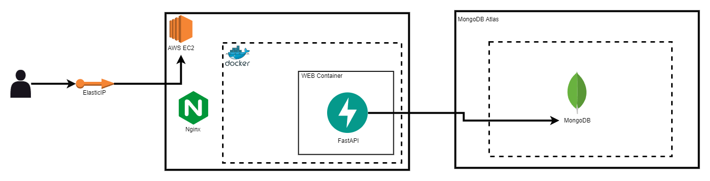
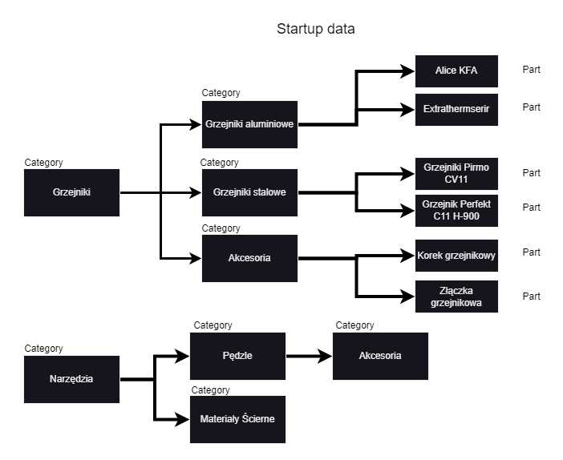
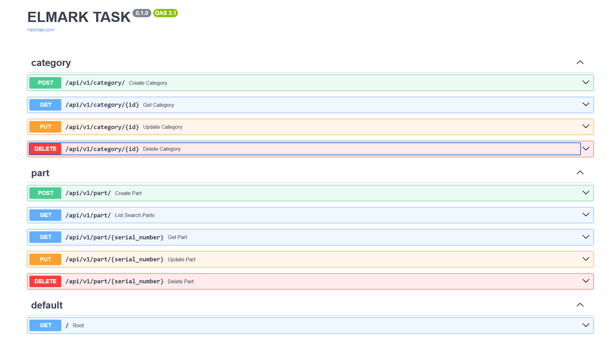

<br />
<div align="center">
  <h3 align="center">Parts Warehouse</h3>
</div>

## Description

### Architecture
#### Short description of architecture
I created my own database and deployed the project to an AWS EC2 instance. 
I also used the Continuous Deployment (CD) technique using Github Actions to automatically deploy code to an AWS EC2 instance
Deployed version of this app is available at this address: http://13.49.58.212/docs




#### Why FastAPI
I chose the FastAPI framework because of:
- Database Requirements: Given the use of a NoSQL database, FastAPI was chosen for its enhanced control. In comparison, Django's built-in ORM system lacks official support for NoSQL databases
- Project Size: With only two models/collections and a few basic endpoints for data operations, FastAPI offers a lightweight and efficient solution.

#### API design
- In the endpoints I used the singular and did not mix it with the plural

```
/part
/category
```
- I used API versioning
```
/api/v1
```

### Endpoints




##### [POST] /api/v1/category/
<details>
  <summary><strong>cURL Example</strong></summary>

 cURL:
```
curl --location 'localhost:8000/api/v1/category/' \
--header 'Content-Type: application/json' \
--data '{
    "name": "Wiadra",
    "parent_name": "Metal"
}'
```

Response:
```
{
    "_id": "65b2e261d1fd45025628a880",
    "name": "Wiadra",
    "parent_name": "Metal"
}
```

</details>


##### [GET] /api/v1/category/{id}
<details>
  <summary><strong>cURL Example</strong></summary>
cURL:

```
curl --location 'localhost:8000/api/v1/category/65b2e261d1fd45025628a880'
```

Response:
```
{
    "_id": "65b2e261d1fd45025628a880"
    "name": "Wiadra",
    "parent_name": "Metal"
}
```

</details>

##### [PUT] /api/v1/category/{id}
<details>
  <summary><strong>cURL Example</strong></summary>

cURL:
```
curl --location --request PUT 'localhost:8000/api/v1/category/65b2e261d1fd45025628a880' \
--header 'Content-Type: application/json' \
--data '{
    "name": "Wiaderka"
}'
```

Response:
```
{
    "_id": "65b2e261d1fd45025628a880",
    "name": "Wiaderka",
    "parent_name": null
}
```
</details>


##### [DELETE] /api/v1/category/{id}
<details>
  <summary><strong>cURL Example</strong></summary>

cURL:
```
curl --location --request DELETE 'localhost:8000/api/v1/category/65b2e261d1fd45025628a880'
```

Response:
```
{
    "message": "Category deleted successfully"
}
```
</details>


##### [POST] /api/v1/part/
<details>
  <summary><strong>cURL Example</strong></summary>

cURL:
```
curl --location 'localhost:8000/api/v1/part/' \
--header 'Content-Type: application/json' \
--data '{
  "serial_number": "aadasjadsadsadsb",
  "name": "Allen key",
  "description": "Some description for this part",
  "category": "Allen",
  "quantity": 5,
  "price": 25,
  "location": {
    "room": "Room11",
    "bookcase": "A",
    "shelf": "C1",
    "cuvette": "H",
    "column": 10,
    "row": 5
  }
}'
```

Response:
```
{
    "_id": "65b2d3947b2f630d89bad853",
    "serial_number": "aadasjadsadsadsb",
    "name": "Allen key",
    "description": "Some description for this part",
    "category": "Allen",
    "quantity": 5,
    "price": 25.0,
    "location": {
        "room": "Room11",
        "bookcase": "A",
        "shelf": "C1",
        "cuvette": "H",
        "column": 10,
        "row": 5
    }
}
```
</details>


##### [GET] /api/v1/part/ (Search)
<details>
  <summary><strong>cURL Example</strong></summary>

cURL:
```
curl --location 'localhost:8000/api/v1/part/?name=Allen&description=Some&category=Allen&serial_number=aa'
```


Response:
```
[
    {
        "_id": "65b2d3947b2f630d89bad853",
        "serial_number": "aadasjadsadsadsb",
        "name": "Allen key",
        "description": "Some description for this part",
        "category": "Allen",
        "quantity": 5,
        "price": 25.0,
        "location": {
            "room": "Room11",
            "bookcase": "A",
            "shelf": "C1",
            "cuvette": "H",
            "column": 10,
            "row": 5
        }
    },
    {
        "_id": "65b2d3947b2f630d89bad853",
        "serial_number": "aadasjadssssadsadsb",
        "name": "Allen key 2",
        "description": "Some description for this part",
        "category": "Allen",
        "quantity": 1,
        "price": 100.0,
        "location": {
            "room": "Room11",
            "bookcase": "Z",
            "shelf": "C1",
            "cuvette": "H",
            "column": 10,
            "row": 5
        }
    }
]
```
</details>


##### [GET] /api/v1/part/{id}
<details>
  <summary><strong>cURL Example</strong></summary>

cURL:
```
curl --location 'localhost:8000/api/v1/part/65b2d3947b2f630d89bad853'
```

Response:
```
{
    "_id": "65b2d3947b2f630d89bad853",
    "serial_number": "aadasjadsadsadsb",
    "name": "Allen key",
    "description": "Some description for this part",
    "category": "Allen",
    "quantity": 5,
    "price": 25.0,
    "location": {
        "room": "Room11",
        "bookcase": "A",
        "shelf": "C1",
        "cuvette": "H",
        "column": 10,
        "row": 5
    }
}
```
</details>

##### [PUT] /api/v1/part/{id}
<details>
  <summary><strong>cURL Example</strong></summary>

cURL:
```
curl --location --request PUT 'localhost:8000/api/v1/part/65b2d3947b2f630d89bad853' \
--header 'Content-Type: application/json' \
--data '{
    "serial_number": "aadasjadssssadsadsb",
    "name": "Allen key 123",
    "description": "Some description for this part",
    "category": "AllenTool",
    "quantity": 5,
    "price": 25.0,
    "location": {
        "room": "Room11",
        "bookcase": "A",
        "shelf": "C1",
        "cuvette": "H",
        "column": 10,
        "row": 5
    }
}'
```

Response:
```
{
    "_id": "65b2d3947b2f630d89bad853",
    "serial_number": "aadasjadssssadsadsb",
    "name": "Allen key 123",
    "description": "Some description for this part",
    "category": "AllenTool",
    "quantity": 5,
    "price": 25.0,
    "location": {
        "room": "Room11",
        "bookcase": "A",
        "shelf": "C1",
        "cuvette": "H",
        "column": 10,
        "row": 5
    }
}
```
</details>

##### [DELETE] /api/v1/part/{id}
<details>
  <summary><strong>cURL Example</strong></summary>

cURL:
```
curl --location --request DELETE 'localhost:8000/api/v1/part/65b2d3947b2f630d89bad853'
```

Response:
```
{
    "message": "Part deleted successfully"
}
```

</details>


## Tech stack:
- Python
  - FastAPI
  - Uvicorn
- AWS 
  - EC2
  - ElasticIP
- Docker & Docker-compose
- MongoDB
- Nginx

## Installation
Clone repository
```bash
git clone https://github.com/DEENUU1/elmark-task.git
```
Create .env file
```bash
cp .env_example .env
```

Example of .env
```txt 
DEBUG="True"
TITLE="ELMARK TASK"
MONGO_DATABASE_NAME=KACPER_WLODARCZYK
MONGO_CONNECTION_STRING=
```

Build docker-compose
```bash
docker-compose build
```

Run docker-compose
```bash
docker-compose up
```
Or
```bash
docker-compose up -d
```

**Documentation is available at this address http://localhost:8000/docs**

## Authors

- [@DEENUU1](https://www.github.com/DEENUU1)

<!-- LICENSE -->

## License

See `LICENSE.txt` for more information.

